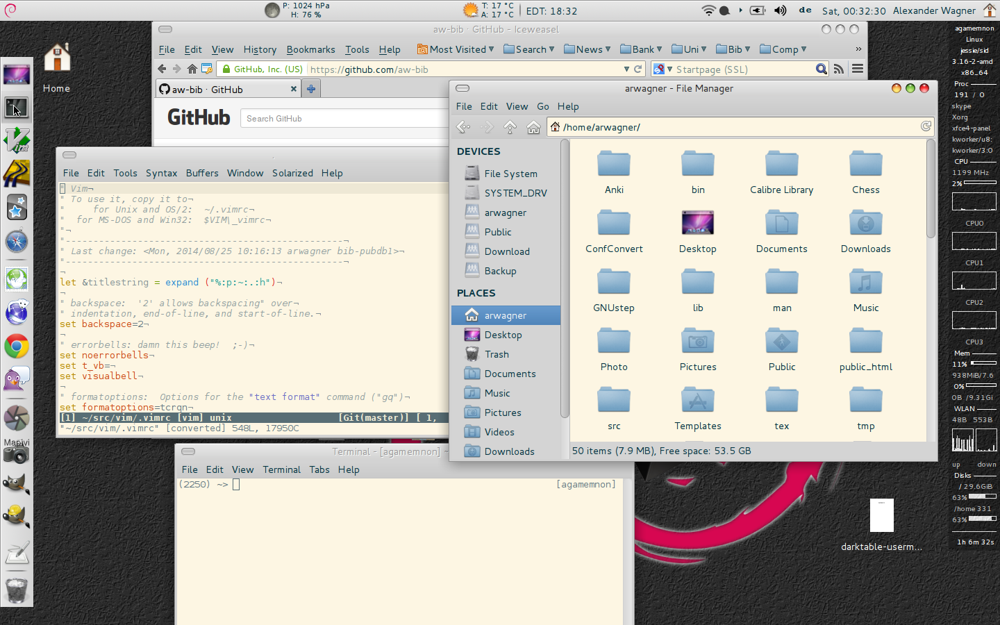

# Shell

Common global and most likely reusable setup for sh and (t)csh like
shells containing helpful aliases, environment parameters and path
settings. These scripts also handle various working environments
(usually they contain setups for OSF1 = Tru64, HP-UX as well as Linux
on i386 and x86_64)

My default shell being zsh, also a .zshrc is included and it might be
that the sh-versions are a bit more up to date than the tcsh-versions.

# X11

## Resources

Using the themes based on Solarized
(http://ethanschoonover.com/solarized) load the necessary settings for
X11. This enables the shells to work well e.g. with vim in solaized
colour mode.

## Themes

A default theme mainly adopted for an xfce4 environment called
aw-gnome is contained in the .themes/ folder. This theme is heavily
based on (http://lassekongo83.deviantart.com/art/Zukitwo-203936861)
but adopts some window buttons from other themes and also uses a
Solarized based background / text colour.

## Icons

This contains only a stub of replacement icons and an X11-mouse
cursor theme. There is also a simple script to setup links to reuse
the base osx theme.

## Screenshot

The desktop shows iceweasel, Thunar, gvim, xfce-terminal, conky and
the various configured panels.

## Config

Contains some setups for Xfce4-programs namely e.g. the terminal to
use solarized colour theme.

## Local

Add some launcher objects for tools unknown to the distributions.

# bin/

Some generic scripts used for setting things up, e.g. emulating the
mouse wheel on a trackpoint, setting up the wacom Intuos 4 with
sensible button defaults an images etc.

## Installation

Just clone and copy.
